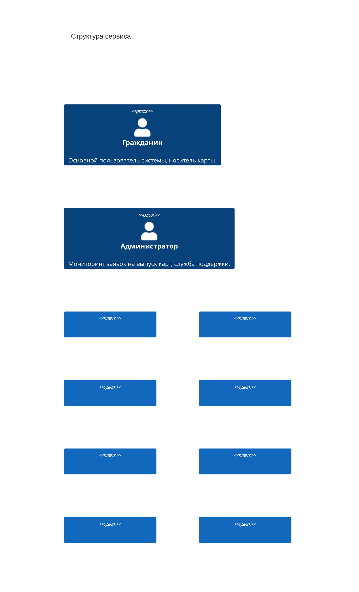

# О проекте

```mermaid
C4Context
    title Структура сервиса
    Person(user, "Гражданин", "Основной пользователь системы, носитель карты.")
    Person(admin, "Администратор", "Мониторинг заявок на выпуск карт, служба поддержки.")
    System(АСОП Cайт, "")
    System(КЖ Cайт, "")
    System(Портал управления, "")
    System(Эльбиус, "")
    System(ПСБ, "")
    System(City-pay, "")
    System(Sber-pay, "")
    System(Инноват, "")
```